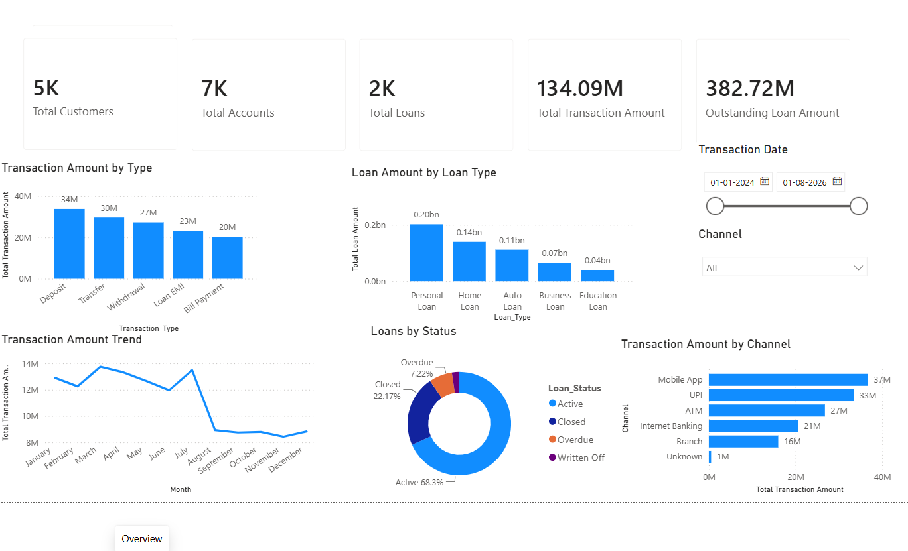

# BankSight Analytics — Banking & Financial Insights Dashboard

## 📊 Project Overview

**BankSight Analytics** is an interactive Power BI dashboard designed to provide a comprehensive view of banking operations, customer activity, accounts, loans, and financial transactions.

The project transforms raw banking data into meaningful business insights through interactive dashboards, KPIs, trend analysis, and portfolio analysis.

The dashboard is designed to help banking stakeholders monitor financial performance, understand customer and account distribution, analyze loan portfolios, and track transaction activity.

---

## 🎯 Business Objectives

The key objectives of this project are to:

* Monitor overall banking performance through key KPIs
* Analyze customer and account distribution
* Understand account and branch-level activity
* Evaluate the loan portfolio by type and status
* Monitor outstanding loan amounts
* Analyze transaction volumes and values
* Identify transaction patterns by type and channel
* Track transaction and loan trends over time

---

## 🛠️ Tools & Technologies

* **Power BI Desktop**
* **DAX**
* **Power Query**
* **Data Modeling**
* **Interactive Data Visualization**

---

## 🗂️ Data Model

The project uses multiple interconnected datasets:

* **Customers**
* **Accounts**
* **Branches**
* **Loans**
* **Transactions**

The data model was structured to support customer, account, branch, loan, and transaction-level analysis.

---

## 📌 Key KPIs

The dashboard tracks the following key metrics:

* **Total Customers**
* **Total Accounts**
* **Total Branches**
* **Account Balance**
* **Average Account Balance**
* **Total Loans**
* **Total Loan Amount**
* **Average Loan Amount**
* **Outstanding Loan Amount**
* **Total Transactions**
* **Total Transaction Amount**
* **Average Transaction Value**

---

## 📑 Dashboard Pages

### 1. Overview

Provides a high-level summary of the banking portfolio with key financial and operational KPIs.

**Key analysis includes:**

* Transaction Amount by Type
* Loan Amount by Loan Type
* Transaction Amount Trend
* Loans by Status
* Transaction Amount by Channel
* Interactive transaction date and channel filters

---

### 2. Customer & Account Analysis

Focuses on customer demographics and account distribution.

**Key analysis includes:**

* Customers by City
* Accounts by Branch
* Accounts by Account Type
* Customers by Gender

---

### 3. Loan Analysis

Provides a detailed view of the bank's loan portfolio.

**Key analysis includes:**

* Loan Amount by Loan Type
* Loans by Status
* Loan Amount Trend
* Loan Status by Loan Type

---

### 4. Transaction Analysis

Analyzes transaction activity across different types, channels, and statuses.

**Key analysis includes:**

* Transaction Amount by Type
* Transaction Amount by Channel
* Transaction Amount Trend
* Transactions by Status
* Transactions by Type & Channel

---

## 💡 Key Insights

The dashboard enables stakeholders to:

* Compare transaction activity across different transaction types
* Understand the distribution of the loan portfolio
* Monitor active and other loan statuses
* Track changes in transaction and loan activity over time
* Compare transaction activity across different channels
* Understand customer distribution across cities and genders
* Analyze account distribution across branches and account types

---

## 📈 Skills Demonstrated

This project demonstrates practical experience in:

* Power BI Dashboard Development
* Data Cleaning & Transformation
* Data Modeling
* DAX Measures
* KPI Development
* Financial & Banking Analytics
* Interactive Visualizations
* Trend Analysis
* Customer Analytics
* Loan Portfolio Analysis
* Transaction Analysis
* Dashboard Design & Storytelling

---

## 📁 Project Files

* `BankSight-Analytics.pbix` — Power BI dashboard file
* `Overview.png` — Overview dashboard
* `Customer & Account Analysis.png` — Customer & Account Analysis dashboard
* `Loan Analysis.png` — Loan Analysis dashboard
* `Transaction Analysis.png` — Transaction Analysis dashboard

---

## 🚀 Project Outcome

**BankSight Analytics** demonstrates how Power BI can transform banking data into an interactive analytical solution that supports financial monitoring, customer analysis, loan portfolio management, and transaction-level decision making.

